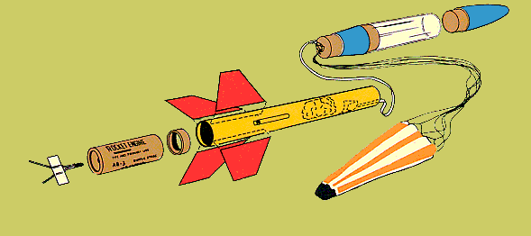
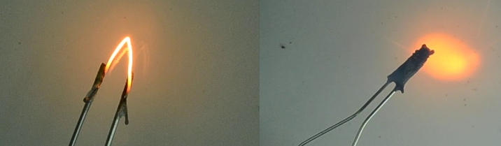
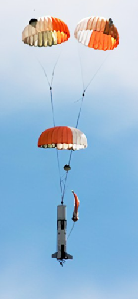

### Reference
  * Rocket Science 101
  * [Liquid Rocket Engine by Nasa](https://www.grc.nasa.gov/www/k-12/airplane/lrockth.html)
  * [Combustion by Glenn guid](https://www.grc.nasa.gov/www/k-12/airplane/combst1.html)
  * [ISRO Sounding Rockets](https://www.isro.gov.in/soundingRockets.html)
---
## Principals on which rocket works on - 
### # Newtons 2nd law - 
    netForce = mass x accelaration
### #  Newtons 3rd law
    Mutual Interaction creates equal & opposite Force

## Types of Rockets
---
1. **Model Rocket**  
---
> `Rocket Engine -`
> they are classified into liquid rockets and solid rockets  
> **Liquid Rocket** = The fuel and the source of oxygen (oxidizer) necessary for combustion are stored separately and pumped into combution chamber where burning occurs.  
>   * Liquid rockets tend to be heavier and more complex because of the pumps used to move the fuel and oxidizer.
> 
> 
> **Solid Rocket** = The fuel and oxidizer are mixed together to form solid propellent, propellent will burn when it exposed to the external source of heat.  
> * Propellent engine mechanism
>
>
> **nozzle** = Used to accelerate hot gasses and produce thrust

---

**2. High Power Rockets**
   
---
### Line between Model & High power rockets(HPRs)
* uses motor more than 160 Newton-second impulse
  * *impulse is how efficiently an engine creates thrust*
* uses motor with more than 80N of average thrust
* exeeds 125g of propellent
* Weighs more than 1500g including motor
* uses of ductile metals

---
**3. Sounding Rocket**  

---
Mostly used for research purpose. It carries instruments to perform experiments in its [sub-orbital flight](https://youtu.be/rLxuoFCfDvQ) (*suborbital flight (altitude 80-100km)*)
  * flight time is less than 30 minutes.
  * uses Propellent motor.
---
**4. Launch Vehicals**  

---
launch vehical rockets are design to carry payload.It should travel at least 150km (orbital) & horizontal velocity should be more tahn 7500mph.  
* Launch Vehical further divide into 4 types (small, medium, heavy, superheavy) based on payload capacity.
  
--- 
## Basic Components of Rocket
-model rocket
### Nose Cone    
[nose cone](https://www.researchgate.net/profile/Ashish-Narayan-2/publication/320213955/figure/fig7/AS:719970266796033@1548665696977/Comparison-of-Mach-number-contours-of-a-spherically-blunted-nose-cone-and-parabolic-nose.png) has shape that causes air to flow smoothly and reduce the aerodynamic drag.

### Body tube
body tube are the airframe of rocket. It is mainly built of cardboard, plastic, fiberglass. It contains Engine mount, recovery system etc..

### Coupler
It can be useful to join tubes which have same or different diameter.

### Fins

Fins are used to give aerodyanmic stability in flight so that rocket can fly streight.
- Fins increases aerodinamic drag in lower section to allow nose point straight.
- Eliptical fins are mostly used in rocket.
**Design to attach Fins**
- wedge - is like rounding the joints.
- Shoulder - is like lego block.

### Rocket motor
Rocket Motor provide thrust to lift the rocket. Above we learned about different types of Rocket motors.  

**geometries of propellent**
- End burner and Core Burner - [click here](https://www.youtube.com/watch?v=Hu_PRwhekMc)

### Launch lugs
  
In beginning rockets velocity is low, so to give aerodynamic guidance or direction to it, we use Launch Lugs to get support from launch pad.

### Igniter
-pyrogen coated tip  
rocket use electrical igniter to deplpoy rocket motor from safe distance.

### Motor mount
used to hold rocket moter steadily.

---

## Rocket Systems
### Recovery System
Recovery System use to land rocket softly on ground. To land softly we need to reduce velocity i.e parachutes are used.  

**There are two techinques for parachute ejextion-**   
  
**1.Pyrotechnic** - ejecting parachute with the help of pressure created by Black powder.  
**2.Non-pyrotechinic** - use mechanism which works on piston or spring to eject the parachute.

### Avionic System
this system consist of computers, sensors, controllers, communication system,power reguations etc..
*Avionic bay is a platform that holds all electronics.*  

**Boards used in Flight Computers -** Arduino , Teensy  

**Sensors -**
- Gyroscope - use for measuring and maintaining angular velocity.
- Accelarometer - use to measure proper acceleration.
- Barometric sensor - to detect atmospheric pressure.